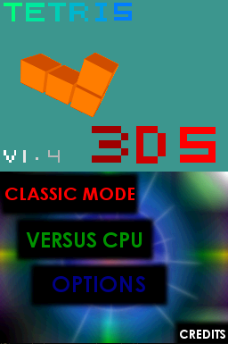
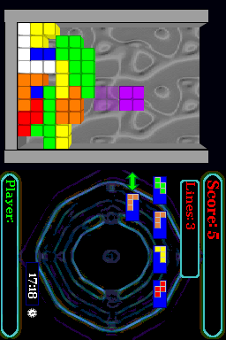
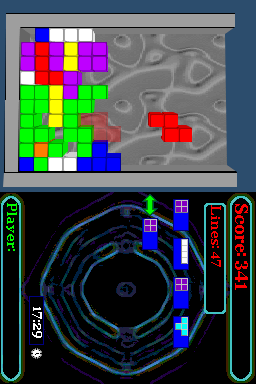
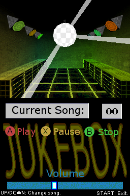

# Tetris 3DS v1.4

This is a 3D tetris game for Nintendo DS and DSi that lets you listen to your
own MP3 songs while you play.

 
 

This game was originally released in 2008 (you can see the original website of
the game [here](http://www.skylyrac.net/old-site/tetris3ds.html), when it won
the 1st price of the NDS games category of the
[Scenery Beta 2008](http://www.scenebeta.com/noticia/final-results-scenery-beta-2008)!


This repository contains a heavily refactored version of the original source
code used to build version 1.3 of the game. The original version was built with
a toolchain that generates NDS ROMs incompatible with DSi. While the game was
updated to build with modern toolchains, I also took the opportunity to clean up
the code a bit. Most of it is still pretty terrible, though, so don't judge it
too harshly. This cleanup has finished in 2025, and the game was written in
2008, when I was still learning how to code!

The game has been released under the license GPL-3.0-only.

## Needed files

Create folder `Tetris_3DS` in the root of your SD card. Then, add as many songs
as you want with the name `Song_XX.mp3`. The game iterates over all songs until
there is a missing number, which will restart the loop. You can also add a song
called `Menu.mp3`, which will play in a loop while in the main menu.

```
SD root
|
|-Tetris_3DS
  |
  |-Tetris_3DS.nds (It can be here or somewhere else!)
  |-Menu.mp3
  |-Song_00.mp3
  |-Song_XX.mp3 (From 01 to 99)
  |-Tetris3DS_Config.dat (Created automatically by the game.)
```

The game will create a file called `Error_Log.txt` if there is a decoding error
so that you can check which files are problematic.

## Converting songs

The Nintendo DS isn't very powerful, and this game uses the ARM7 CPU to decode
the MP3 files themselves. For this to work, the bitrate of the files has to be
very low. One way to convert MP3 files to the right quality for the game is to
use ffmpeg like this:

```
ffmpeg -i input.mp3 -codec:a libmp3lame -b:a 56k -ac 1 -ar 22050 output.mp3
```

If the MP3 file has a too high bitrate, it will most likely cause a decoding
error and the game will stop playing it.

## Menu controls

While in the menu, use the touch screen to move around.

There is a jukebox inside the options menu that lets you play any of the MP3
files you have added to the game folder.

## Gameplay controls

1. Without touchscreen:

   - Normal orientation:

     - Left/Right: Left/Right.
     - Down: Increase fall speed.
     - Up: Piece falls instantly.

   - NDS rotated 90 degrees:

     - Up/Down: Left/Right.
     - Left: Increase fall speed.
     - Right: Piece falls instantly.

   - A: Rotate.
   - X: Switch current piece with the stored piece.
   - START: Pause.

2. With touch screen:

   - Normal orientation:

     - Stylus Left/Right: Left/Right.
     - Stylus Down: Increase fall speed.
     - Quick down movement: Piece falls instantly.
     - Quick up movement: Switch current piece with the stored piece.

   - NDS rotated 90 degrees:

     - Stylus Up/Down: Left/Right.
     - Stylus Left: Increase fall speed.
     - Quick left movement: Piece falls instantly.
     - Quick right movement: Switch current piece with the stored piece.

   - Double tap: Rotate.
   - START: Pause.

After the game ends, records are saved automatically.

## Build instructions

1. Install [BlocksDS](https://blocksds.skylyrac.net/docs/).

2. Install [PAlib](https://github.com/AntonioND/palib) from source.

3. Run the following command in the root of this repository:

   ```
   make -j`nproc`
   ```

## Common errors

### FAT init error

This error may appear when the game starts. This is usually caused when the NDS
ROM is loaded without patching the game with the DLDI driver of the flaschard.

If you have patched the game and it still doesn't work, you can skip the FAT
initialization process by holding R + L when the game loads.

### Guru meditation error

If the game freezes and show a red screen with white numbers, something really
bad has happened. You can help the game development by taking a photo of this
screen and sending a bug report with it!

## Credits

- Mollusk for PAlib.
- Noda for ASlib.
- All of the authors of libnds!
